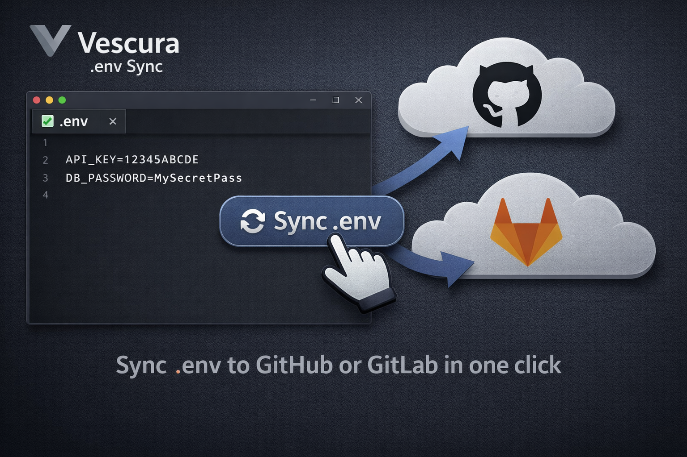
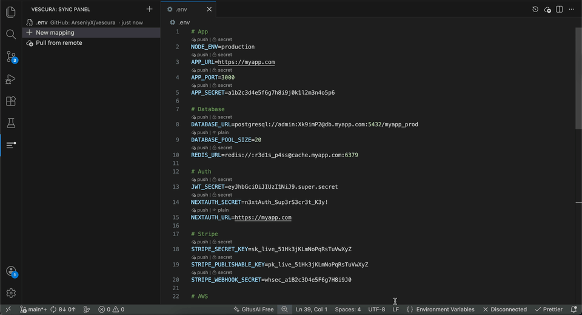

# Vescura

**Push and pull `.env` files to GitHub Secrets & GitLab CI/CD Variables — without leaving VS Code.**

No more copying secrets by hand into browser dashboards. Map a `.env` file to a repo, mark each variable as secret or plain, and sync in one click.

---

## What it does

- **Push** — send variables from any `.env` file to GitHub Secrets or GitLab CI/CD Variables
- **Pull** — fetch remote variables into a local `.env` file
- **Per-variable CodeLens** — inline buttons on every line to toggle `push / skip` and `secret / plain`
- **Environment scoping** — target GitHub Environments or GitLab CI scopes
- **Secure storage** — tokens live in VS Code's encrypted secret store, never on disk

## How it works

1. Open the **Vescura** panel in the Activity Bar and connect GitHub (OAuth) or GitLab (PAT)
2. Click **+** to map a `.env` file to a repository or project
3. Open the file — CodeLens buttons appear on every variable line
4. Click **Push** from the editor toolbar or the panel

## Platforms

| Platform | Auth | Targets |
|---|---|---|
| GitHub | OAuth (one-click, no token) | Repo secrets, Environment secrets |
| GitLab | Personal Access Token (`api` scope) | Project CI/CD variables, Environment scopes |

## Notes

- GitHub secret values are **write-only** via the API — pull writes keys with empty values for secrets
- Mappings are saved in `.envsync.json` (no secrets, safe to commit)

---

[Report an issue](https://github.com/ArseniyX/vescura/issues)
